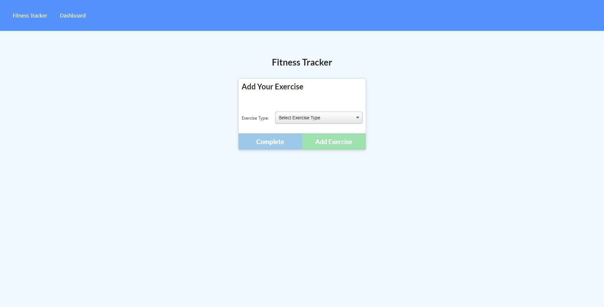

# Workout-Tracker
## Table of Contents
*[Description](#description)
*[Installation](#installation)
*[Usage](#usage)
*[Contributions](#contributions)
*[Tests](#tests)
*[License](#license)
*[Questions](#questions)
## Description
This application helps the user to keep track of the type of excercise and provides visuals for duration and weight of the excercises logged.

## Installation
Install the node modules, and run the application.
## Usage
Select the option of New Workout. Then select the type of excercise and log the information required. After that you can update the created workout or create a new one.
## Contributions
Contributions are open for this project, clone the repo and add your code.
## Tests
No tests were created for this project.
## License
The MIT License
## Questions
If you have questions about this project pleas contact me:
GitHub: https://github.com/00anp/
E-mail: alfonso.nunez29@gmail.com